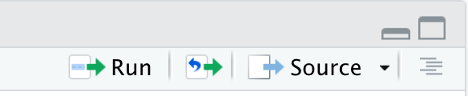
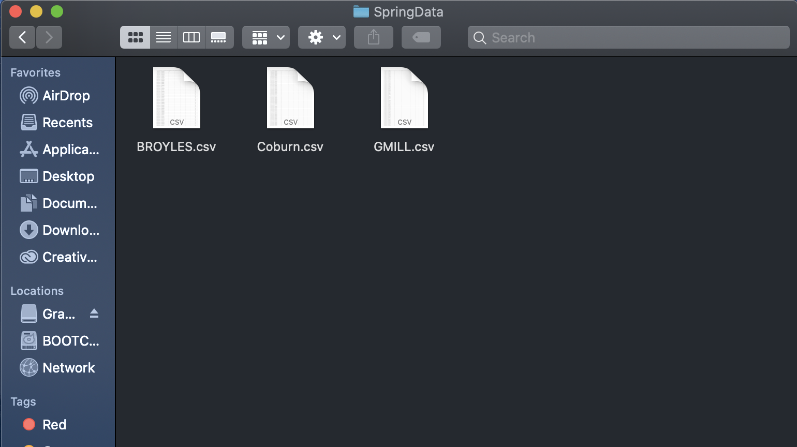

# Manipulating _.csv_ Files that Contain a Variety of Data in Different Formatts 

## Table of contents
* [Introduction](#Introduction)
* [Getting Started](#Getting-Started)
  + [Prerequisites](#Prerequisites)
  + [Installing](#Installing)
* [Running the Code](#Running-the-Code)
  + [Breaking it Down](#Breaking-it-Down)
* [Built With](#Built-With)
* [Author](#Author)

## Introduction

Once in a blue moon, under the arc of a double rainbow, you might find yourself blessed with a perfectly formatted .csv file. However, you awake from your dream and remember that many files are in fact compiled and formatted in ways that make you question your sanity. Thus, you begin your search for a rational way to read and manipulate the files to fit your needs.

For my project, the .csv files that were in need of some TLC were collections of spring data collected over a large temporal and spatial scale. The files were initially unreadable because of the format of the title and the header, which were improperly spaced and did not correlate to each column of data. Due to the nature of the location and time of the data collections, differences in column names and values became a significant problem to overcome. For instance, some files listed the data collection time in GMT-04:00, while others listed it in GMT-05:00. Some files included the range of the spring, while other files omitted this info and thus had fewer columns. Additionally, all of the files grouped _Date_ and _Time_ into the same column, so I took it upon myself to separate them into two distinct columns. Lastly, I appended multiple files from the same sample location into a sinlge, comprehensive file.


## Getting Started

These instructions will get you a copy of the project up and running on your local machine for access to the code, files, and outputs.

From my _Final_ repository in GitHub, we want to select _Clone_ to download a ZIP of my repository. Unzip the ZIP file, enter the Final-working folder, and open the project titled _Desktop.Rproj_. This will open up RStudio and create a relative path from which the files and functions can be accessed. Please note that the .csv files must remain inside of the folder titled _CSV_. 

### Prerequisites

It is a good idea to clear the global environment prior to running this code. Make sure everything you are working on is saved, then, in the consol of RStudio run the code `rm(list = ls())`. 

The following code is used to set stringsAsFactors to false, set the CSV folder containing the .csv files as the path that will be used within the function. The _install.packages_ command downloads the _tidyverse_, which is a collection of packages for data viewing and manipulation. The next command, _library_, loads the tidyverse. The blocks of code are broken up so that problems do not arise on the off-chance that the tidyverse is already installed but not loaded. Though this is an easy problem to fix, it isn't very noticeable and can cause larger issues down the road. 
```
options(stringsAsFactors = F)
path <- "CSV"
install.packages("tidyverse")
```
```
library("tidyverse")
```
## Running the Code

To utilize the function that manipulates the files, we must first _Source_ the function in order to asign the code to our desired name. This allows us to later call upon this function by simply typing the name we have assigned it. To do this, 
open _FunctionSpr.R_ in RStudio by selecting it from the list of files on the right side of the window. 
Once the function is open in the R Script, press the _Source_ button near the top of the page, above the R Script.



For convenience, the function within _FunctionSpr.R_ is also listed below. 

```
SpringDat.R <- function(path) {
  glob.path <- paste0(path, "/*", ".csv")
  dataFiles <- lapply(Sys.glob(glob.path), read.csv, skip=1, header=T)
  datepat <- "\\d{2}\\/\\d{2}\\/\\d{2}"
  timepat <- "\\d{2}\\:\\d{2}\\:\\d{2} [AP]M"
  GMTpat <- "\\d{2}.\\d{2}"
  Temppat <- "Temp[\\.Â]+?[FC]"
  for (i in 1:length(dataFiles)){
    DTCol <- dataFiles[[i]][, grepl("Date.Time", names(dataFiles[[i]]))]
    dataFiles[[i]]$Date <- str_extract(DTCol,datepat)
    dataFiles[[i]]$Time <- str_extract(DTCol,timepat)
    GMTval <- str_extract(names(dataFiles[[i]])[grepl("Date.Time", names(dataFiles[[i]]))], GMTpat)
    timecol <- paste0("Time, GMT-", substr(GMTval,1,2),":",substr(GMTval,4,5))
    names(dataFiles[[i]])[names(dataFiles[[i]])=="Time"] <- timecol
    dataFiles[[i]] <- dataFiles[[i]][, !grepl("Date.Time", names(dataFiles[[i]]))]
    tempcolname <- names(dataFiles[[i]])[grepl("Temp", names(dataFiles[[i]]))]
    Fextrc <- str_extract(tempcolname, Temppat)
    is_F <- substr(Fextrc, nchar(Fextrc),nchar(Fextrc))=="F"
    if (is_F) {
      dataFiles[[i]] <- dataFiles[[i]] %>% 
        mutate(convert=(!!as.name(tempcolname) - 32) * 5/9 )
      Cextrc <- str_replace(Fextrc,"F","C")
      newcolname <- str_replace(tempcolname, Fextrc, Cextrc)
      dataFiles[[i]] <- dataFiles[[i]][, !grepl("Temp", names(dataFiles[[i]]))]
      names(dataFiles[[i]])[names(dataFiles[[i]])=="convert"] <- newcolname
    }
    dataFiles[[i]] <- dataFiles[[i]] %>% 
      select(!!as.name(names(dataFiles[[i]])[1]), Date, !!as.name(timecol), if(is_F)newcolname else tempcolname, everything())
  }
  filepattern <- "\\S+?_"
  locations <- c()
  for (i in 1:length(dataFiles)){
    locations <- c(locations,str_extract(basename(Sys.glob(glob.path)[i]),filepattern))
  }
  output <- list()
  for (unique_location in unique(locations)){
    tmp <- NULL
    for (i in 1:length(locations)){
      if(locations[i]==unique_location){
        tmp <- bind_rows(tmp,dataFiles[[i]])
      }
    }
    output[[unique_location]] <- tmp
  }
  dir.create("SpringData", showWarnings = F)
  for (i in 1:length(output)){
    filename <- paste0(substr(names(output)[i],1,nchar(names(output)[i])-1),".csv")
    write_csv(output[[i]], file.path("SpringData",filename))
  }
}
```
Once the function has been run in RStudio, it can be applied to numerous files/folders simply by inputting the name of the object of interest. In this case, the folder containing the spring .csv files is called CSV, so the function is applied to this folder. The next step is to run `SpringDat.R("CSV")` to apply the function to the folder containing the .csv files.

This command will run and edit each file individually, then export them to a newly created folder titled "SpringData" that will show up within the working directory. The newly edited files that were collected from the same sample location (those that share the same unit serial number) will be consolidated into one large .csv file that lists the sample location as their name. This allows different files of the same location to be grouped together for easier file management.

Th output of the command can be seen below, with the new SpringData folder located in the working directory.


Within _SpringData_, the consolidated files for Broyles, Coburn, and Gmill are displayed.



The files are now conveniently located in their own folder. If you would like a preview of how the data is formatted, you can run the code below and a table will display the info of _BROYLES_ in RStudio.
```
BROYLES <- read_csv("SpringData/BROYLES.csv")
View(BROYLES)
```
The table will look like this:


### Breaking it Down

Although I was able to accomplish my tasks in the last section, this section's purpose is to provide some explanation about the code within my function. 

The very first line of code renames the function of the path (in this case the path being = to CSV) to _SpringDat.R_, which can then be called upon from the command line at a later time. The subsequent code allows us to read the .csv files while also skipping over some of the unnecessary headers. Patterns are assigned to names ("timepat", "datepat", "GMTpat", and "Temppat") so that they may be called upon at a later time to edit the _Date.Time_ columns.
```
SpringDat.R <- function(path) {
   glob.path <- paste0(path, "/*", ".csv")
   dataFiles <- lapply(Sys.glob(glob.path), read.csv, skip=1, header=T)
   datepat <- "\\d{2}\\/\\d{2}\\/\\d{2}"
   timepat <- "\\d{2}\\:\\d{2}\\:\\d{2} [AP]M"
   GMTpat <- "\\d{2}.\\d{2}"
   Temppat <- "Temp[\\.Â]+?[FC]"
```
The next part of the function utilizes two of the patterns that were previously created ("datepat", and "timepat")to separate the _Date.Time_ column into two separate columns.
```
   for (i in 1:length(dataFiles)){
      DTCol <- dataFiles[[i]][, grepl("Date.Time", names(dataFiles[[i]]))]
      dataFiles[[i]]$Date <- str_extract(DTCol,datepat)
      dataFiles[[i]]$Time <- str_extract(DTCol,timepat)
      GMTval <- str_extract(names(dataFiles[[i]])[grepl("Date.Time", names(dataFiles[[i]]))], GMTpat)
```
The next part of the function creates a new time column that is formatted as _Time GMT-0*:00_.
```
      timecol <- paste0("Time, GMT-", substr(GMTval,1,2),":",substr(GMTval,4,5))
      names(dataFiles[[i]])[names(dataFiles[[i]])=="Time"] <- timecol
```
The next part of the function drops the original _Date.Time_ column using the _grep_ command, since separate columns were created for both _Date_ and _Time_.
```
      dataFiles[[i]] <- dataFiles[[i]][, !grepl("Date.Time", names(dataFiles[[i]]))]
```
The next part of the function checks to see if the _Temp_ column is listed in fahrenheit or celcius. If the column name includes _°F_, the temp values are converted to celcius and the column name is edited so that _F_ is replaced by _C_. If the column already includes _°C_, no change is made.
```
      tempcolname <- names(dataFiles[[i]])[grepl("Temp", names(dataFiles[[i]]))]
      Fextrc <- str_extract(tempcolname, Temppat)
      is_F <- substr(Fextrc, nchar(Fextrc),nchar(Fextrc))=="F"
      if (is_F) {
        dataFiles[[i]] <- dataFiles[[i]] %>% 
         mutate(convert=(!!as.name(tempcolname) - 32) * 5/9 )
       Cextrc <- str_replace(Fextrc,"F","C")
       newcolname <- str_replace(tempcolname, Fextrc, Cextrc)
       dataFiles[[i]] <- dataFiles[[i]][, !grepl("Temp", names(dataFiles[[i]]))]
       names(dataFiles[[i]])[names(dataFiles[[i]])=="convert"] <- newcolname
      }
      dataFiles[[i]] <- dataFiles[[i]] %>% 
        select(!!as.name(names(dataFiles[[i]])[1]), Date, !!as.name(timecol), if(is_F)newcolname else tempcolname,    everything())
   }
```
The following code consolidates all of the data from each sample location into a singular file, ie. all of the samples taken from BROYLES will be appended into a file called "BROYLES.csv". It accomplishes this by creating a pattern ("filepattern") that identifies the name of the sample location before the first underscore in the name. All of the files that share the same serial number will now have the same filename due to the use of this pattern within the for loop. At this point the files are merged together using the _bind_rows_ command, which conveniently merges them in chronological order.
```
    filepattern <- "\\S+?_"
      locations <- c()
      for (i in 1:length(dataFiles)){
       locations <- c(locations,str_extract(basename(Sys.glob(glob.path)[i]),filepattern))
  }
      output <- list()
      for (unique_location in unique(locations)){
       tmp <- NULL
       for (i in 1:length(locations)){
         if(locations[i]==unique_location){
           tmp <- bind_rows(tmp,dataFiles[[i]])
         }
       }
       output[[unique_location]] <- tmp
     }
```
The command below creates a new folder named "SpringData" where the outputs of appended spring files will be sent. This new folder will be created within the working directory ("Final-working").
```
      dir.create("SpringData", showWarnings = F)
      for (i in 1:length(output)){
       filename <- paste0(substr(names(output)[i],1,nchar(names(output)[i])-1),".csv")
       write_csv(output[[i]], file.path("SpringData",filename))
      }
}
```
Congratulations! You have successfully taken control of your computer and cleaned up those .csv files! The best part is, you aren't even dreaming this time. 

## Built With

RStudio


## Author

Hartford Johnson
